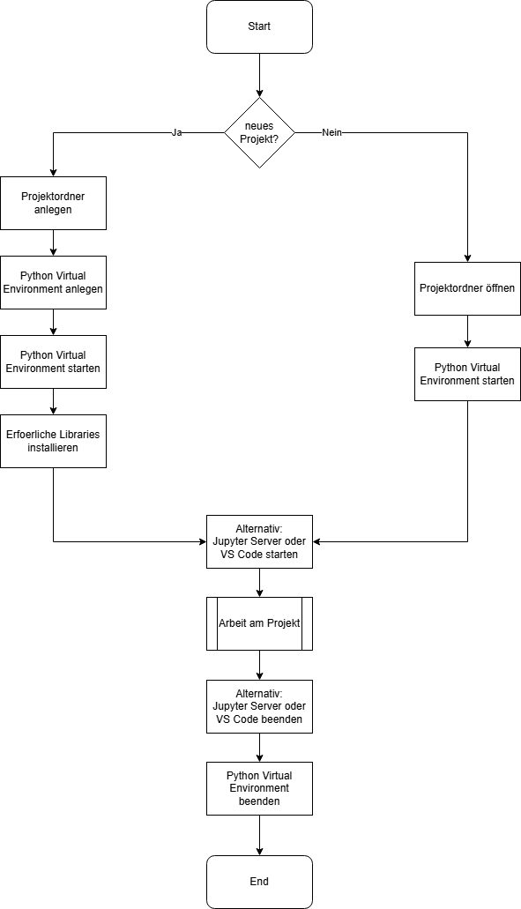

Ich erwarte, dass Sie in der Lage sind

* Pyhton Listen anzulegen;
* Python Dictionaries anzulegen;
* über Listen und Dictionaries zu iterieren;
* die Funktionsweise von Selection Sort bzw. Merge Sort zu beschreiben und
  bezüglich ihrer Effizienz miteinander zu vergleichen;
* Python Code, welcher selection sort bzw. merge sort implementiert zu erläutern sowie
* einfache rekursive Funktionen zu schreiben.

Ausserdem erwarte ich, dass Sie in der Lage sind, auf alles schon getestete
zurückzugreifen.

Hier die überarbeitete Darstellung der Startsequenz:

