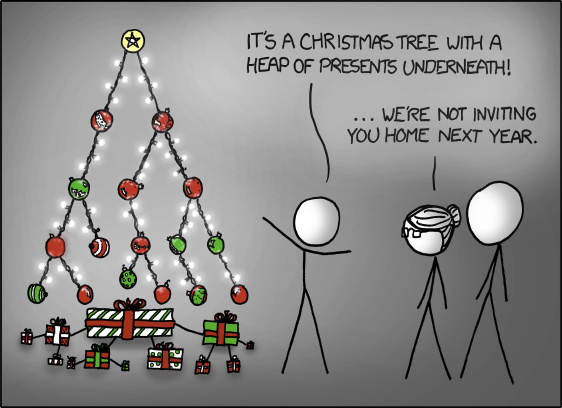

Die bisher verwendete Python Listen sind sehr einfach zu bedienen. Allerdings
verschleiern sie die zu Grunde liegende Datenstruktur.  
Bei einer Python Liste handelt es sich um ein dynamisches Array. Ein Array ist
eine Datenstruktur, bei der im Voraus ein zusammenhängender Speicherbereich von
fixer Grösse definiert wird. Bei einem dynamischen Array fällt die Restriktion
der fixierten Grösse weg und dem Speicherplatz wird laufend den Bedürfnissen
angepasst. Die Anpassung der Grösse des Speicherbereichs ist allerdings mit
erheblichem Rechenaufwand verbunden. Diesem Nachteil steht allerdings der
Vorteil gegenüber, dass in einem Array mittels des Index mit konstantem Aufwand
auf die einzelnen Elemente zugegriffen werden kann. Falls das Array sortiert
ist, kann ausserdem relativ effizient nach einem Element in dieser Datenstruktur
gesucht werden.

Eine Alternative für das Ablegen einer Sequenz von Elementen mit nicht im Voraus
bestimmten Umfang, ist eine verkettete Liste (linked list).   
Die verkettete Liste (linked list) ist eine Datenstruktur, bei der mit einer
Variabel auf das erste gespeicherte Element verwiesen wird. Zusammen mit diesem
Element wird auch der Speicherort des nächsten Elementes gespeichert. Von dieser
Verkettung von Element zu Element hat die Datenstruktur ihren Namen. In einer
verketteten Liste lassen sich neue Elemente mit konstantem Aufwand einfügen.
Allerdings hat die verkettete Liste den Nachteil, dass die Suche nach einem
Element mit linearem Aufwand verbunden ist.

An dieser Stelle kommt der binäre Suchbaum (binary search tree, bst) ins Spiel.

>## Bäume in der Informatik
>
><figure>
>  
>  <figcaption>Quelle: xkcd.com/835, besucht am 4. Mai 24</figcaption>
></figure>
>
>Ein Baum in der Informatik ist eine Datenstruktur die aus Knoten (engl.
>Vertex bzw. vertices, V) und Kanten (engl. edge, E) besteht. Der erste
>Knoten ist die Wurzel (engl. root). Alle anderen Knoten haben einen
>Knoten als Elternknoten. Ein Elternknoten kann ein oder mehrere
>Kindknoten haben. Ein Knoten ohne Kinder wird als Blatt bezeichnet.
>Üblicherweise werden Bäume vom Wurzelknoten aus nach unten dargestellt.

Ein binärer Suchbaum ist eine baumförmige Datenstruktur, bei der jeder Knoten
ein oder zwei Kinder hat. Die Werte in den Knoten sind 
dabei so in den Baum eingeordnet, dass jedes linke Kind kleiner ist als der
Elternknoten und jedes rechte Kind grösser. Im Idealfall ist der Baum
symmetrisch ausbalanciert. Es kann allerdings auch sein, dass ein binärer
Suchbaum derart aus dem Gleichgewicht ist, dass er wie eine verkettete Liste
aussieht. Aus diesem Grund muss bei der Effizienzbetrachtung dieser
Datenstruktur zwischen Idealfall und Worst Case unterschieden werden. Im
Idealfall ist die Suche und das Einfügen neuer Elemente mit einem Aufwand von
$log(n)$ möglich. Im Worst Case verursacht die Suche einen linearen Aufwand.

Die folgende Grafik zeigt ein Beispiel eines binären Suchbaums.

