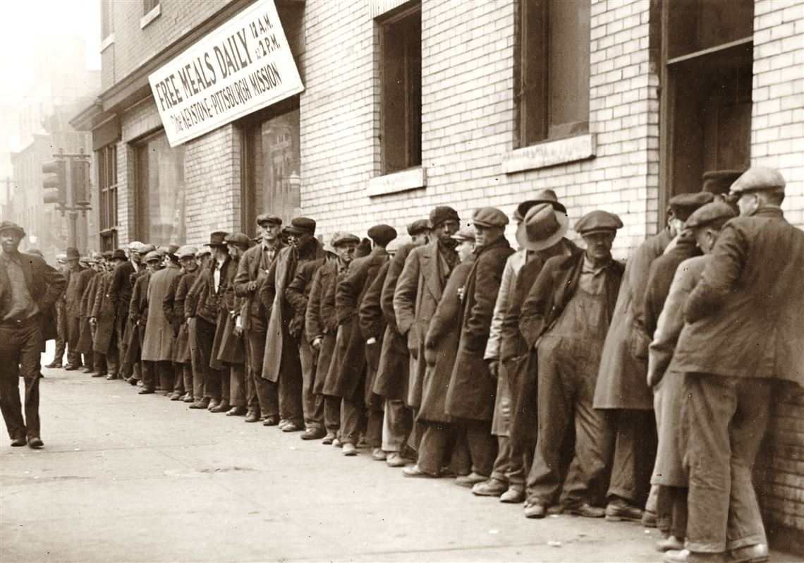

Zwei wichtige Datenstrukturen zur Lösung alltäglicher Probleme sind der Stack
(Stapelspeicher) und Queue (Warteschlange). In beiden Datenstrukturen können
mehrere Werte zwischengespeichert werden. Die beiden Speicherformen sollen
hier kurz erläutert werden.

In einem Stack werden die gespeicherten Werte *gestapelt*. Wie in einem Stapel
in der realen Welt, wird der letzte gespeicherte Wert zuoberst auf den Stapel
gelegt. Ebenso wie in einem realen Stapel, können die gespeicherten Werte nur in
umgekehrter Reihenfolge zu ihrer Speicherung wieder abgerufen werden (last in -
first out; LIFO).  
Ein Stack kann dazu verwendet werden, um die Verarbeitungsreihenfolge von
Rechenoperationen in einem Programm abzubilden.

<figure>
    
    <figcaption style="font-size: 10px;">Martin Mayer mit einem Stapel Brot (Quelle: Sasa Noël und Heike Grein, Brothandwerk, Aarau und München, 2021, Seite 50)</figcaption>
</figure>

In einer Queue werden die gespeicherten Werte in einer Warteschlange
*eingereiht*. Wie in einer Warteschlange in der realen Welt, wird jeder neu
gespeicherte Wert hinten eingereiht. Beim Abrufen der gespeicherten Werte wird
der zuerst gespeicherte Wert zuerst verarbeitet (first in - first out; FIFO).  
Eine Queue kann dazu verwendet werden, eine Warteschlange abzubilden wie sie in
Netzwerken für die Übermittlung von Datenpaketen gebraucht wird.

<figure>
    
    <figcaption style="font-size: 10px;">Dole Queue Great Depression (Quelle: https://view.genially.com/609aac10d34c960d5992809a/interactive-content-great-depression-breakout, besucht am 22.01.15).</figcaption>
</figure>

Für die Übungen finden Sie hier eine [Klasse Node](src/nodes.py) 
und eine 
[Klasse Linked List](src/linked_list.py)
zum Download.