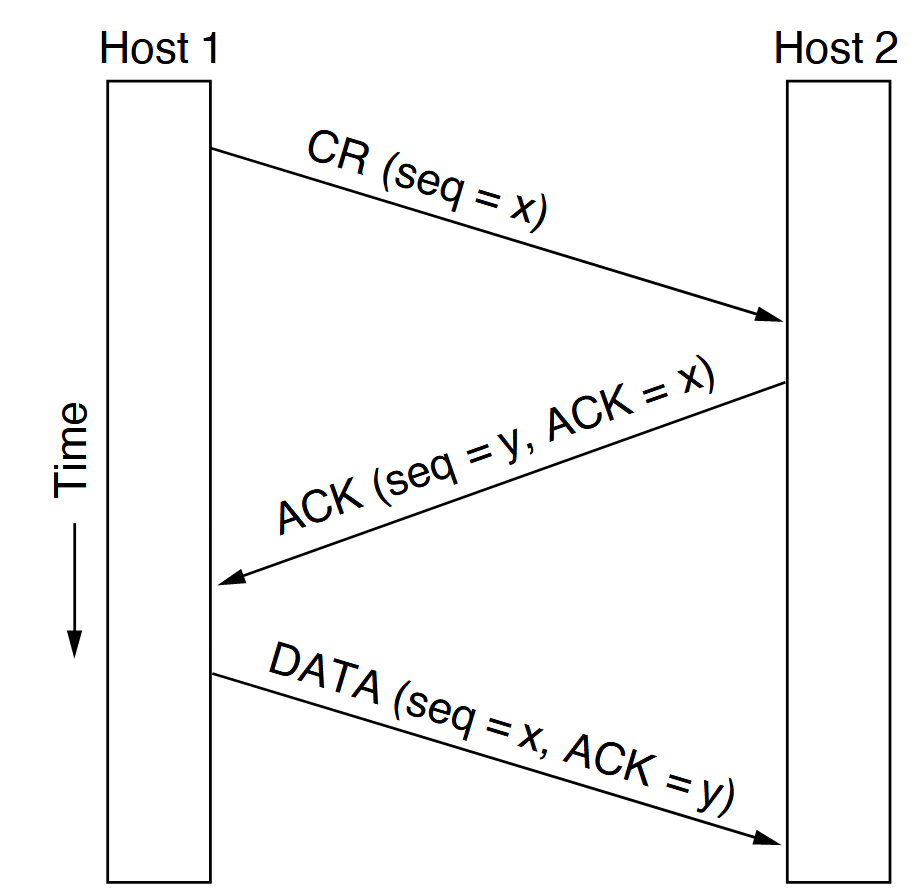

The following explanations are based on the analysis of network packets
recorded with Wireshark. This requires the installation of
Wireshark. The 
<a href="https://www.wireshark.org/#download" target="_blank">
Wireshark website</a>  provides the
corresponding download.

## Recording network packets

To record network packets, start Wireshark. The
Wireshark start window looks like this:


Under the heading ‘Capture’, you can select the desired network adapter
and start recording. The captured packets
are displayed in real time and can be analysed later. At
school, the connection to the Internet is established via WLAN.
The WLAN adapter must be selected accordingly. Once the appropriate
adapter has been selected, recording can be started.
Recording is started by clicking on the blue
shark fin icon in the toolbar. Recording starts
immediately. Recording is paused by clicking on the
red square icon in the toolbar. The recording can be saved either
via the File > Save menu, by clicking on the file icon
or by using the key combination `Ctrl + S`.

## Monitoring DNS requests

### Filtering the recording

To monitor DNS requests, any website is called up while Wireshark
recording is running. This captures the
corresponding DNS requests, which can then be analysed in Wireshark.
After calling up the website, the recording can be 
paused and the captured packets analysed (if the
recording continues, the packets in the display window
continue to move).

To display the relevant data packets, the
recorded data traffic can be filtered. The filter is entered in the
input field for ‘Display filter’.


The corresponding filter for DNS queries to a given website
is

```txt
dns.qry.name == "www.example.com"
```

The filter command used is relatively easy to understand.
The first thing to note here is the protocol being filtered. Because
the filtering is based on DNS queries, this is `dns`. `dns` alone
would already be a valid filter. However, this would then display all DNS packets
. The filter is therefore supplemented to `dns.qry.name`, where
`qry` is short for query. The addition `name` stands for the domain name
that is being queried. `==` is the logical operator used for filtering
and means ‘is equal to’ in this case. The string being searched for is between the quotation marks.
If the page was accessed exactly once during recording, the filter will display two packets: one
DNS query and one DNS response.
If the page was accessed multiple times during recording, the filter
will display multiple packets. 


The image shows the DNS query for
www.deutschegrammaphon.com as the first packet and the corresponding
response as the second packet.

### Analysis of the filtered packets

For a detailed analysis of the communication, a single packet can be
selected by clicking on it. This will display the packet in the lower
area of Wireshark in detail and it can be examined more closely.


That it is the details of the selected packet that are shown in the
image is evident from the matching packet number. The lines in the 
detail view correspond to the individual protocol header fields of the
selected packet. This also reflects the TCP/IP layering model.

The detail view can be expanded by clicking on the triangles at the beginning of the
individual protocol header fields. This will display
further information about the respective fields. However, only the
summaries of the header fields are explained here. 

In this example, the content of the Internet layer header is explained first.

```text

Internet Protocol Version 4, Src: 192.168.1.108, Dst: 192.168.1.1

```

In the summary, the source and destination addresses of the IP packet
are displayed. In this case, these are the private IP addresses
192.168.1.108 and 192.168.1.1. 192.168.1.108 is the source address,
identifiable by the abbreviation "Src", and 192.168.1.1 is the
destination address, identifiable by the abbreviation "Dst". Both
devices are thus located in the same LAN. The computer with the IP
address 192.168.1.1 is the router. This device establishes the Internet
connection and can answer DNS queries from its cache.

In the header for the User Datagram Protocol (UDP), the source and
destination ports are displayed.

```text
User Datagram Protocol, Src Port: 53586, Dst Port: 53
```
The source port was automatically chosen as 53586, well above the
so-called "Well-Known Ports" (0-1023). The "Well-Known Ports" are ports
that are used by certain applications or services by default. Accordingly,
the destination port was set to 53, as this is the default port for
DNS queries. A list of "Well-Known Ports" can be found in the
<a
href="https://www.iana.org/assignments/service-names-port-numbers/service-names-port-numbers.xhtml"
target="_blank">
official IANA port database</a>. The source port allows the
destination system to send the response back to the correct sender.

NAT devices (see [Section Network Address Translation (NAT)](../250820/nat.qmd))
use this port information for the mapping between private and public addresses.

The layer displayed at the bottom of the detail view contains the actual
request for the translation of the domain name into an IP address. 

```text
Domain Name System (query)
    Transaction ID: 0x1f7a
    Flags: 0x0100 Standard query
    Questions: 1
    Answer RRs: 0
    Authority RRs: 0
    Additional RRs: 0
    Queries
        www.deutschegrammophon.com: type A, class IN
    [Response In: 723]
```

For this reason, this part of the analysis is also unfolded here.
Under the keyword `Queries`, the requested address
`www.deutschegrammophon.com` is displayed. The keyword `type A` indicates
that this is a request for an IPv4 address.
IPv4 addresses are designated with `A`, while IPv6 addresses are
designated with `AAAA`. The last element in this line is the class of
the request, in this case `IN` for the Internet. Although today almost
exclusively the Internet is used as a network type, the field for the
class (IN) is still part of every DNS request for historical reasons. 

The corresponding content of the response looks as follows:

```text
Domain Name System (response)
    Transaction ID: 0x1f7a
    Flags: 0x8180 Standard query response, No error
    Questions: 1
    Answer RRs: 1
    Authority RRs: 0
    Additional RRs: 0
    Queries
        www.deutschegrammophon.com: type A, class IN
    Answers
        www.deutschegrammophon.com: type A, class IN, addr 85.236.46.65

```

The packet repeats the question and provides the answer from the DNS server.
The domain name `www.deutschegrammophon.com` is associated with the IPv4 address
`85.236.46.65`.

This allows the connection to the website `www.deutschegrammophon.com`
to be established.

## Monitoring of the Connection Establishment

The connection establishment between the client (local computer) and the server
(computer on the Internet) takes place in several steps, which are summarized in
the so-called "Three-Way Handshake". This process ensures that both sides are ready
to send and receive data.  
The following illustration shows a schematic representation of the "Three-Way Handshake".



The client sends a SYN packet to the server to request a connection.
The server responds with a SYN-ACK packet. This means it acknowledges the request with an ACK and inquires with a SYN whether the client is (still) ready to establish the connection. To make it clear that the ACK in the SYN-ACK packet refers to the original SYN packet, the individual packets are assigned a sequence number. The ACK returns the sequence number of the SYN packet plus one.

This process can be observed with Wireshark. For this, a combined Wireshark display filter is needed. As an example, the connection establishment between the local computer and the website of www.deutschegrammophon.com is considered. The first part of the filter should only display those packets that communicate with the IP address of the server of www.deutschegrammophon.com (85.236.46.65). This filter is

```wireshark
ip.addr == 85.236.46.65
```

This sole filter, however, still shows too many packets.


To further narrow down the results, only those packets should be displayed that have either the SYN flag or the ACK flag (or both) set. This can be achieved with the following filter:

```wireshark
ip.addr == 85.236.46.65 and (tcp.flags.syn == 1 or tcp.flags.ack == 1 )
```

Still, this shows way too many packets. Therefore, only those packets
should be displayed that are the responses to a SYN request. This can be
achieved by right-clicking on a packet with the SYN flag and selecting
the "Follow" > "TCP Stream" option. This will display the entire TCP
stream in which this packet is located (the consecutive packets). The
filter will be automatically adjusted. 

The following listing shows the entire filter command for displaying the
packets belonging to this TCP stream:

```wireshark
ip.addr == 85.236.46.65 and (tcp.flags.syn == 1 or tcp.flags.ack == 1) and !(tcp.stream eq 8)
```


That the packets show the communication sequence of the Three-Way
Handshake can be seen from the set flags. In the first step, the client
sends a SYN packet, to which the server responds with a SYN-ACK packet.
The client confirms this with an ACK packet. These three steps are
visible in the Wireshark filter. The respective port numbers used in the
TCP packets are clearly recognizable. 

Following this "Three-Way Handshake", the client can communicate with the
server.